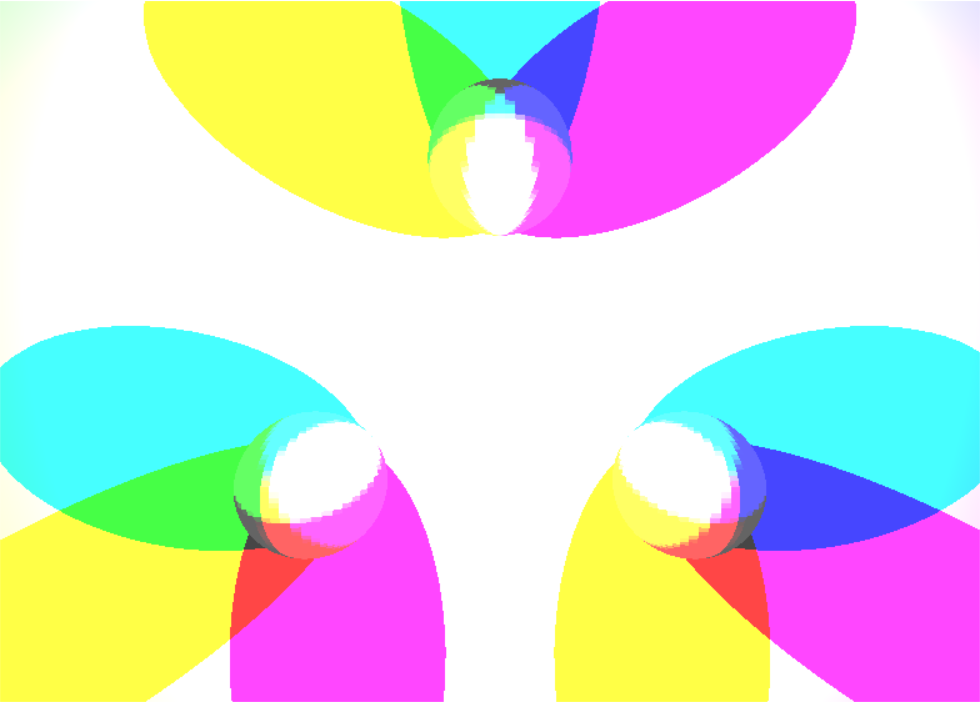
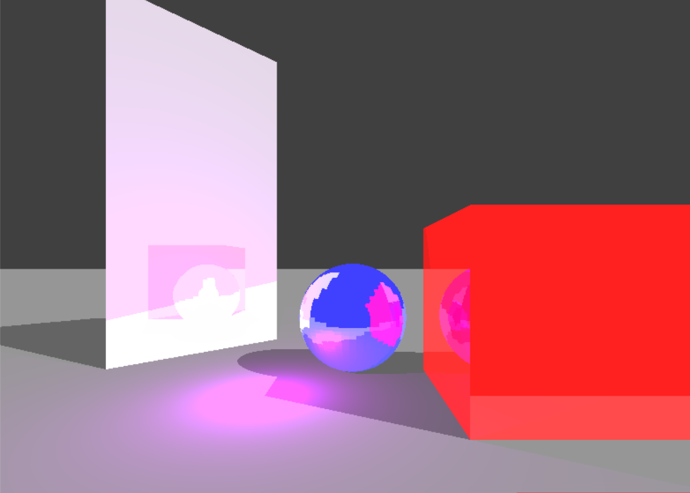
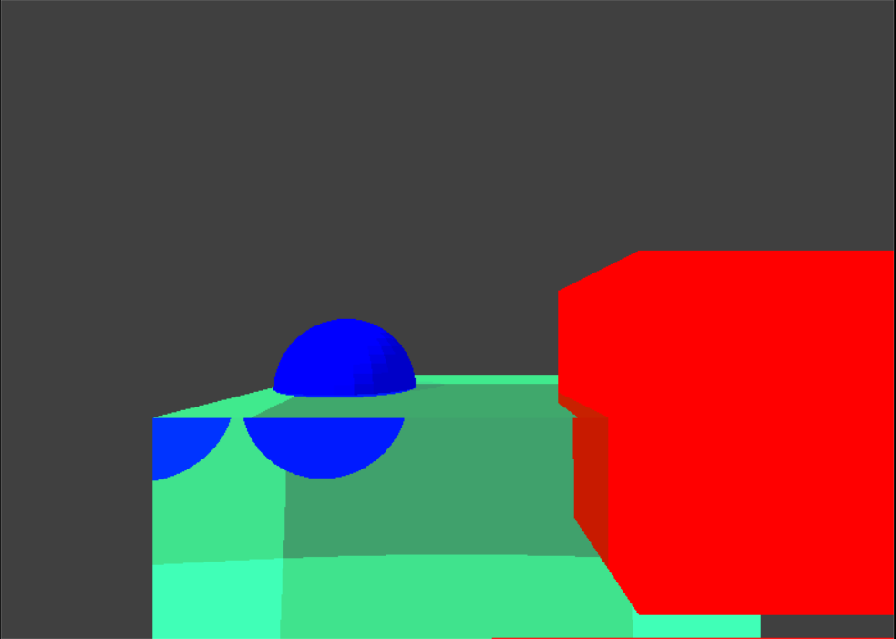
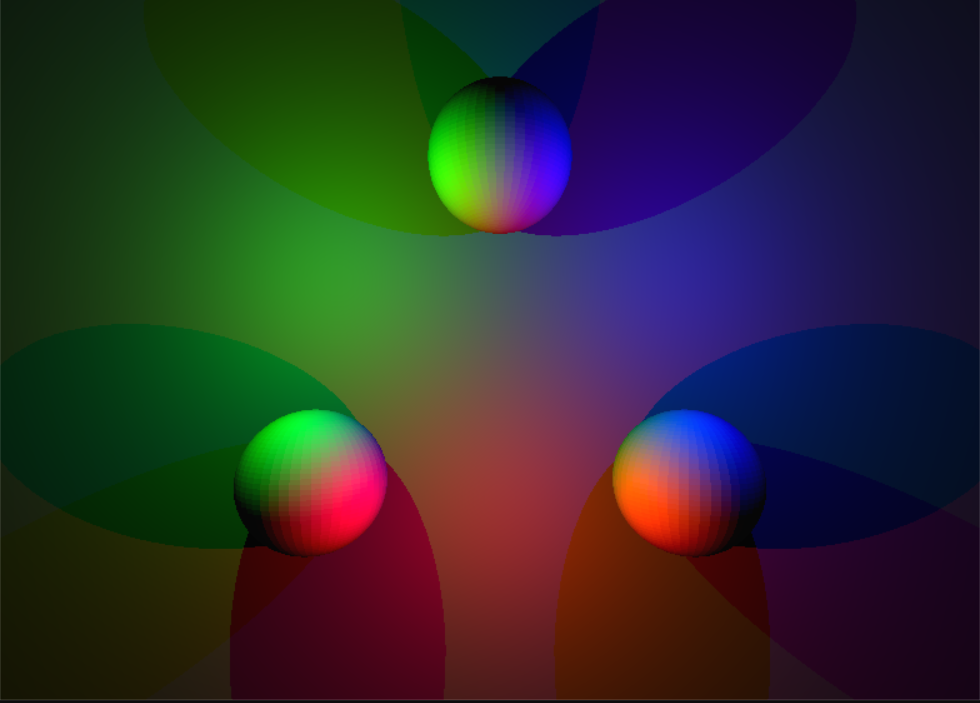
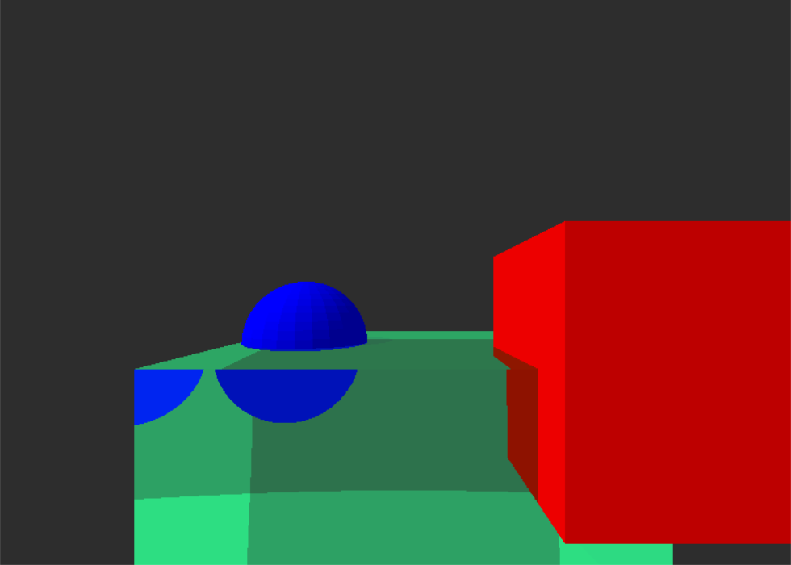

# Ray Tracing

## Abstract

The project implements backwards ray tracing i.e the projector rays are casted from the camera and then checked for intersections with the mesh in the scene. If such intersections are obtained, the closest one is chosen to be the real intersection that would have occured between a light ray and the mesh. Based on the surface properties of the mesh new rays are generated, emanating from the point of intersection of the original ray and the mesh. These newly generated rays are then used as reflected or refracted rays, or to evaluate the lighting at the intersection point.

## Method Used

A recursive function is used to simulate the branching of rays after collision with surfaces. The pixel color value depends on a weighted sum of color values generated by each ray-mesh intersection. The weights depend on the properties of the mesh surface. Desired materials can be generated by defining these properties appropriately.

### Diffuse Lighting

The project demonstrates 2 types of lights, point and directional lights. Lighting at point is calculated as follows:

* A ray is cast from the ray-mesh intersection point towards the light source (for directional lights, this will be in a direction opposite to the direction of light).

* If the ray does not intersect with any mesh, before reaching the light source (for direction lights, this will be at infinity), the the surface point is lit by the light.

* Since the surfaces implemented as perfectly diffuse, color calcluation are easy.

### Ray Mesh Intersection Calculation

Since the intersection msut be calculated with millions of rays, a structure (refered to as the collTriangle in this project) is initialized to represent each triangle and accelerate intsersection calculations.

This structure contains the mathematical description of the plane of the triangle (a point and a normal), and 3 planes perpendicular ot the triangle containing the sides of the triangle.

The plane of the triangle is used to calculate the ray-mesh intersection and the other 3 side planes are used to check whether the intersection is inside the triangle or not.

## Problems Faced

Some of the inital images obtained were either too staured or too dark and required precise lighting to produce the full range of colors.

_Images depecting saturated colors_

### Reason for the issue:

Each screen pixel can display 256 shades per color i.e each pixel requires 3*8 bits of data or 3 bytes of data.

Since the color calculations utilizes floating point operations, it is easy to overshoot the maximum limit of 256 per color channel and hence the resulting image looks too saturated.

### Solution:

The solution to this problems comes from the biology of the human body. The human eye is adaptive in nature i.e if too much light enters the eye, the iris shrinks to reduce the light inflow preventing the light sensitive cells in the eye from getting overwhelmed. Such a solution can be implemented in software.

The entire scene is rendered with floating point operations. The brightest pixel on the screen can the be used as an upper limit. The conversion from floating point to an 8-bit unsigned integer then becomes a map from the interval, (0, determined upper limtit) to the interval, (0, 255).

_Images after applying the color correction_