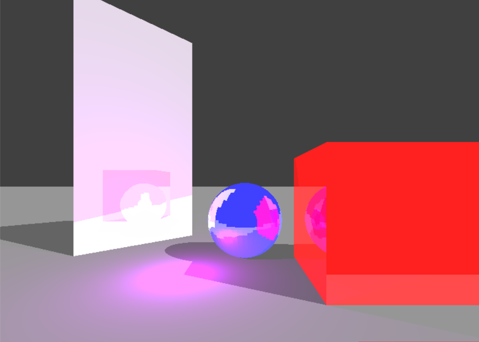
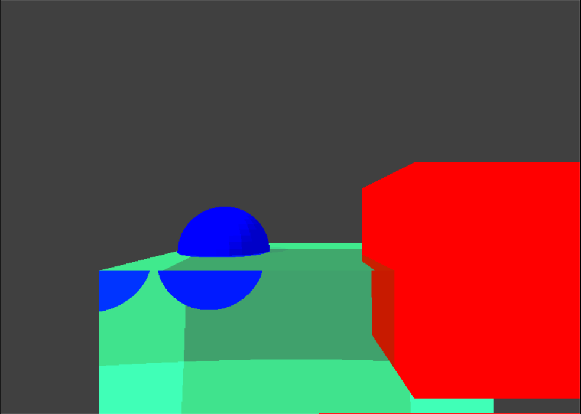
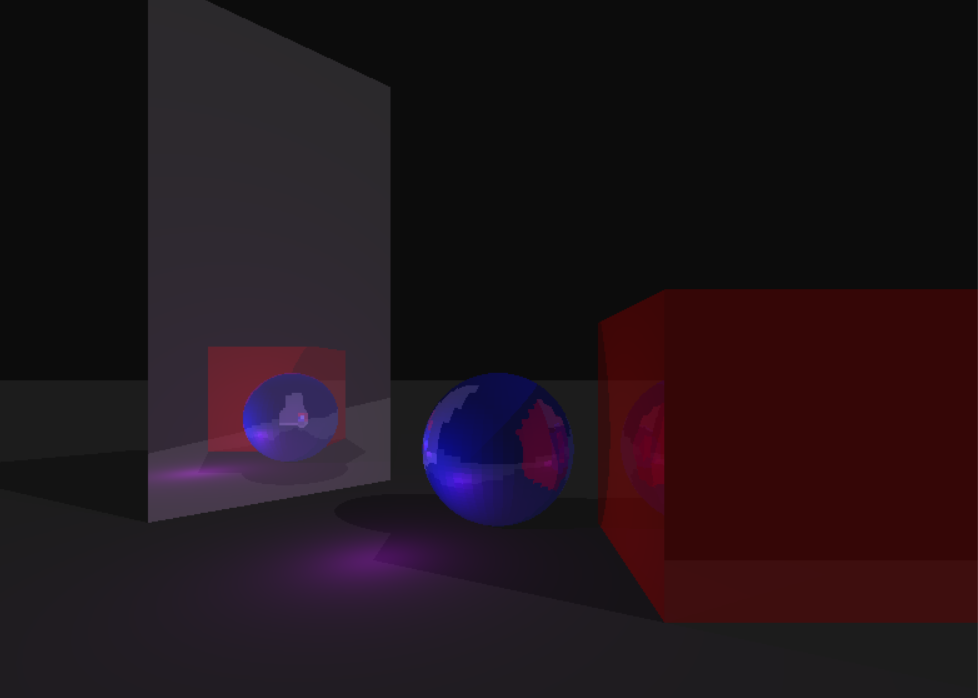
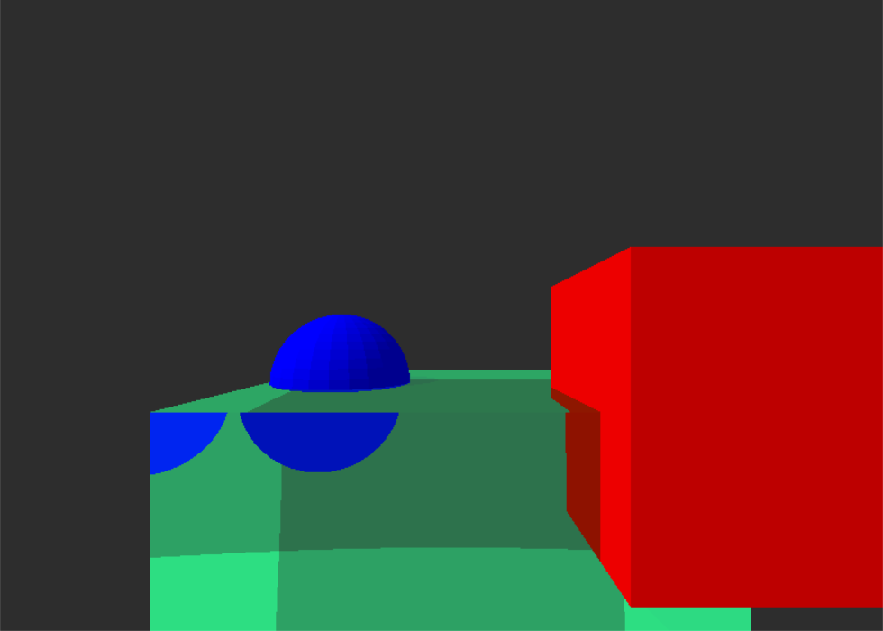

## Problems Faced

Some of the inital images obtained were either too staured or too dark and required precise lighting to produce the full range of colors.

_Images depecting saturated colors_

### Reason for the issue:

Each screen pixel can display 256 shades per color i.e each pixel requires 3\*8 bits of data or 3 bytes of data.

Since the color calculations utilizes floating point operations, it is easy to overshoot the maximum limit of 256 per color channel and hence the resulting image looks too saturated.

### Solution:

The solution to this problems comes from the biology of the human body. The human eye is adaptive in nature i.e if too much light enters the eye, the iris shrinks to reduce the light inflow preventing the light sensitive cells in the eye from getting overwhelmed. Such a solution can be implemented in software.

The entire scene is rendered with floating point operations. The brightest pixel on the screen can the be used as an upper limit. The conversion from floating point to an 8-bit unsigned integer then becomes a map from the interval, (0, determined upper limtit) to the interval, (0, 255).

_Images after applying the color correction_
